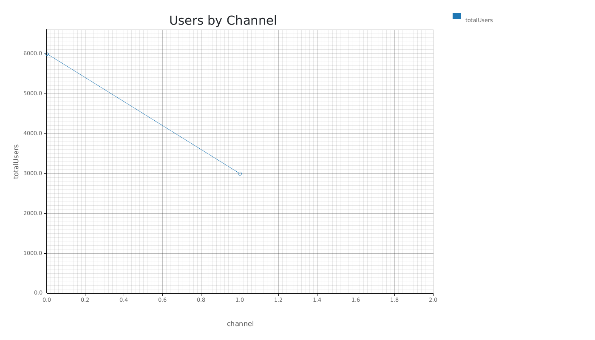
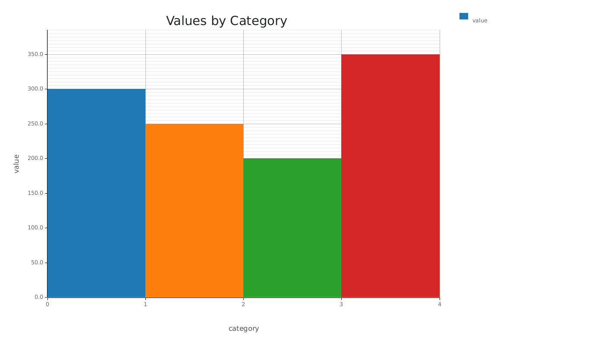
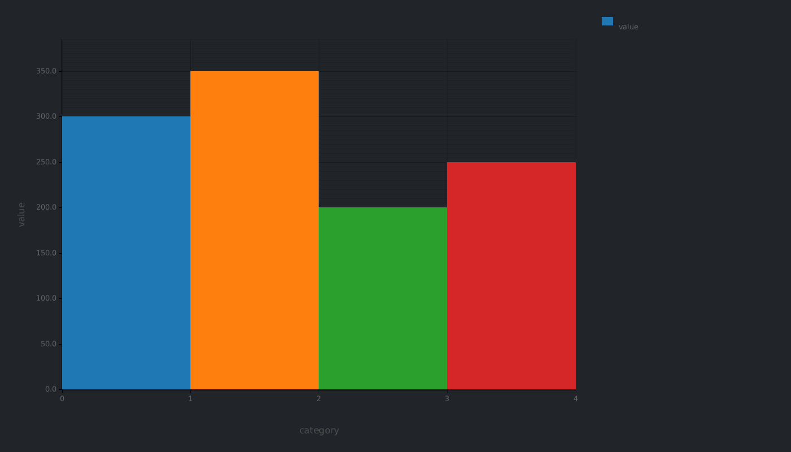
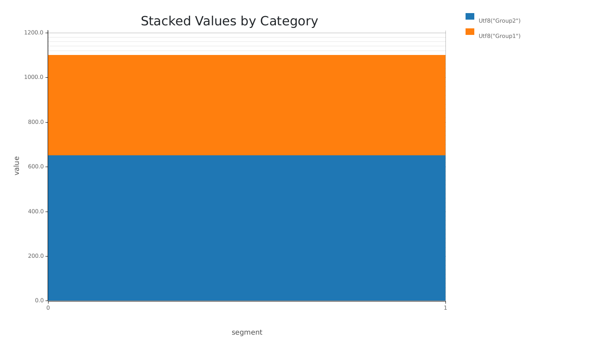
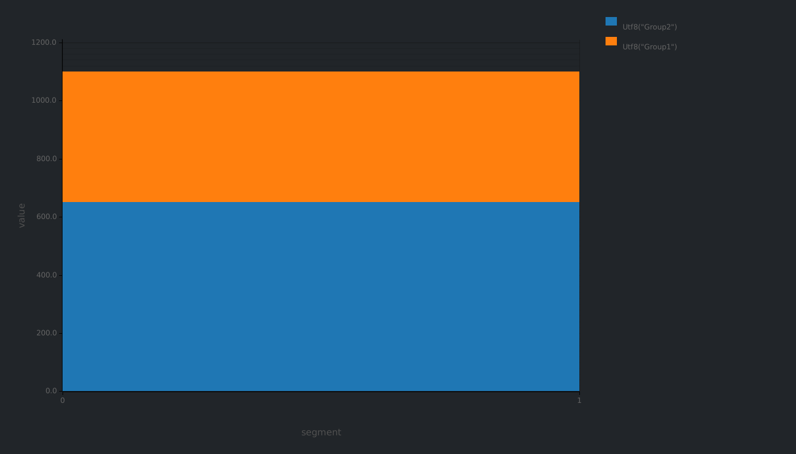
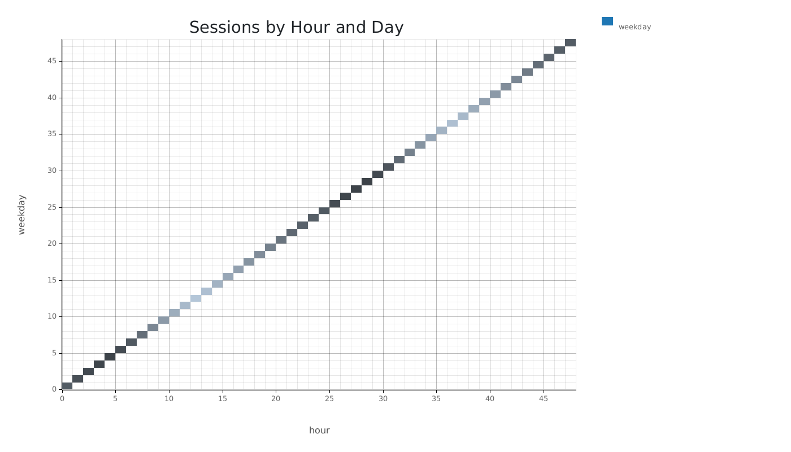
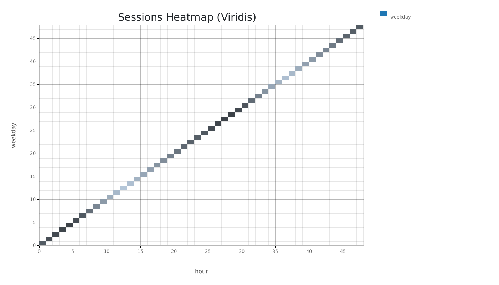
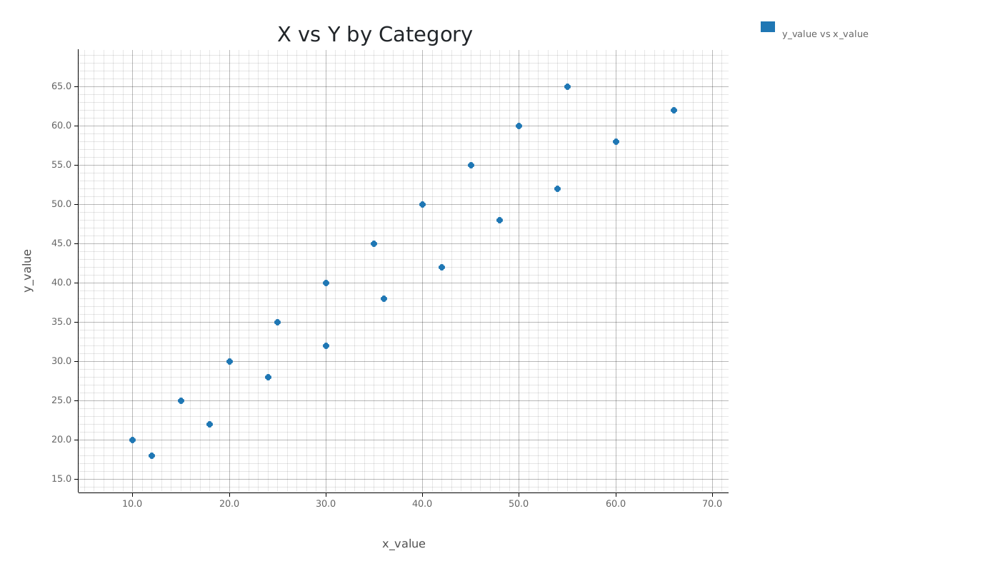

# Graff Chart Examples

This document showcases all available chart types in Graff with examples in both light and dark themes.

## Overview

Graff supports 8 chart types, each optimized for different data visualization needs:

- **Line Charts**: Time series and trend analysis
- **Area Charts**: Composition and stacked data
- **Bar Charts**: Categorical comparisons
- **Stacked Bar Charts**: Composition analysis
- **Heatmaps**: 2D data visualization
- **Scatter Plots**: Correlation analysis
- **Funnel Charts**: Conversion analysis
- **Retention Charts**: Cohort analysis

All charts support both light and dark themes for different presentation contexts.

## Line Charts

Line charts are perfect for showing trends over time and comparing multiple series.

### Simple Line Chart


**Description**: Simple line chart showing user trends over time.

**Command**:
```bash
graff line --input data.csv --x date --y totalUsers --title "Users Over Time"
```

### Multi-Series Line Chart



**Description**: Multi-series line chart showing users by channel with grouping.

**Command**:
```bash
graff line --input data.csv --x date --y totalUsers --group channel --title "Users by Channel"
```

## Area Charts

Area charts are ideal for showing composition and stacked data over time.

### Stacked Area Chart


**Description**: Stacked area chart showing user composition by channel over time.

**Command**:
```bash
graff area --input data.csv --x date --y totalUsers --group channel --title "User Composition Over Time"
```

### Normalized Area Chart


**Description**: Normalized area chart showing percentage composition.

**Command**:
```bash
graff area --input data.csv --x date --y totalUsers --group channel --normalize --title "User Composition (%)"
```

## Bar Charts

Bar charts are excellent for categorical comparisons and grouped data.

### Simple Bar Chart



**Description**: Simple bar chart showing values by category.

**Command**:
```bash
graff bar --input data.csv --x category --y value --title "Values by Category"
```

### Grouped Bar Chart


**Description**: Grouped bar chart showing values by category and segment.

**Command**:
```bash
graff bar --input data.csv --x category --y value --group segment --title "Values by Category and Segment"
```

### Horizontal Bar Chart


**Description**: Horizontal bar chart for better label readability.

**Command**:
```bash
graff bar --input data.csv --x category --y value --group segment --horizontal --title "Values by Category (Horizontal)"
```

## Stacked Bar Charts

Stacked bar charts show composition within categories.

### Stacked Bar Chart



**Description**: Stacked bar chart showing composition by segment.

**Command**:
```bash
graff bar-stacked --input data.csv --x category --y value --group segment --title "Stacked Values by Category"
```

## Heatmaps

Heatmaps visualize 2D data with color intensity representing values.

### Session Activity Heatmap



**Description**: Heatmap showing session activity by hour and day of week.

**Command**:
```bash
graff heatmap --input data.csv --x hour --y weekday --z sessions --title "Sessions by Hour and Day"
```

### Heatmap with Custom Colormap



**Description**: Heatmap with viridis color scheme for better colorblind accessibility.

**Command**:
```bash
graff heatmap --input data.csv --x hour --y weekday --z sessions --colormap viridis --title "Sessions Heatmap (Viridis)"
```

## Scatter Plots

Scatter plots reveal correlations and relationships between variables.

### Simple Scatter Plot


**Description**: Simple scatter plot showing correlation between variables.

**Command**:
```bash
graff scatter --input data.csv --x x_value --y y_value --title "X vs Y Correlation"
```

### Scatter Plot by Category



**Description**: Scatter plot with points colored by category.

**Command**:
```bash
graff scatter --input data.csv --x x_value --y y_value --group category --title "X vs Y by Category"
```

## Funnel Charts

Funnel charts track conversion rates through sequential steps.

### Standard Conversion Funnel


**Description**: Standard conversion funnel showing drop-off at each step.

**Command**:
```bash
graff funnel --input data.csv --steps "Visited,Viewed Product,Added to Cart,Started Checkout,Completed Purchase" --values value --title "Conversion Funnel"
```

### Funnel with Left Labels


**Description**: Funnel chart with value labels on the left side.

**Command**:
```bash
graff funnel --input data.csv --steps "Visited,Viewed Product,Added to Cart,Started Checkout,Completed Purchase" --values value --value-labels left --title "Conversion Funnel (Left Labels)"
```

## Retention Charts

Retention charts show user retention over time for different cohorts.

### Retention Matrix


**Description**: Retention matrix showing user retention over time.

**Command**:
```bash
graff retention --input data.csv --cohort-date cohort_date --period-number period_number --users users --title "User Retention Matrix"
```

### Retention Matrix (Percentages)


**Description**: Retention matrix showing retention percentages.

**Command**:
```bash
graff retention --input data.csv --cohort-date cohort_date --period-number period_number --users users --percentage --title "User Retention Matrix (%)"
```

## Theme Support

All charts support both light and dark themes:

- **Light Theme**: White backgrounds with dark text, ideal for presentations and reports
- **Dark Theme**: Dark backgrounds with light text, perfect for dashboards and dark mode applications

### Theme Usage

```bash
# Light theme (default)
graff line --input data.csv --x date --y value --theme light

# Dark theme
graff line --input data.csv --x date --y value --theme dark
```

## Color Accessibility

Graff uses colorblind-friendly palettes based on ColorBrewer:

- **10 distinct colors** that work well for colorblind users
- **High contrast** between colors for better visibility
- **Consistent color mapping** across all chart types
- **Theme-appropriate** color adjustments for light and dark modes

## Data Requirements

Each chart type has specific data requirements:

### Time Series Charts (Line, Area)
- **Required**: `x` (date/time), `y` (numeric value)
- **Optional**: `group` (for multiple series)

### Categorical Charts (Bar, Bar Stacked)
- **Required**: `x` (category), `y` (numeric value)
- **Optional**: `group` (for grouping or stacking)

### 2D Data Charts (Heatmap)
- **Required**: `x` (first dimension), `y` (second dimension), `z` (value for color intensity)

### Correlation Charts (Scatter)
- **Required**: `x` (first variable), `y` (second variable)
- **Optional**: `group` (for color coding)

### Conversion Charts (Funnel)
- **Required**: `steps` (comma-separated step names), `values` (numeric values)

### Cohort Charts (Retention)
- **Required**: `cohort_date`, `period_number`, `users`

## Best Practices

1. **Choose the right chart type** for your data and analysis goals
2. **Use descriptive titles** that clearly explain what the chart shows
3. **Group related data** when comparing multiple series
4. **Consider your audience** when choosing between light and dark themes
5. **Use appropriate color schemes** for your data type and audience

## Command Reference

For complete command-line options, see the main documentation or run:

```bash
graff --help
graff <chart-type> --help
```

Available chart types:
- `line` - Line charts for time series
- `area` - Area charts for composition
- `bar` - Bar charts for categories
- `bar-stacked` - Stacked bar charts
- `heatmap` - Heatmaps for 2D data
- `scatter` - Scatter plots for correlation
- `funnel` - Funnel charts for conversion
- `retention` - Retention charts for cohorts
